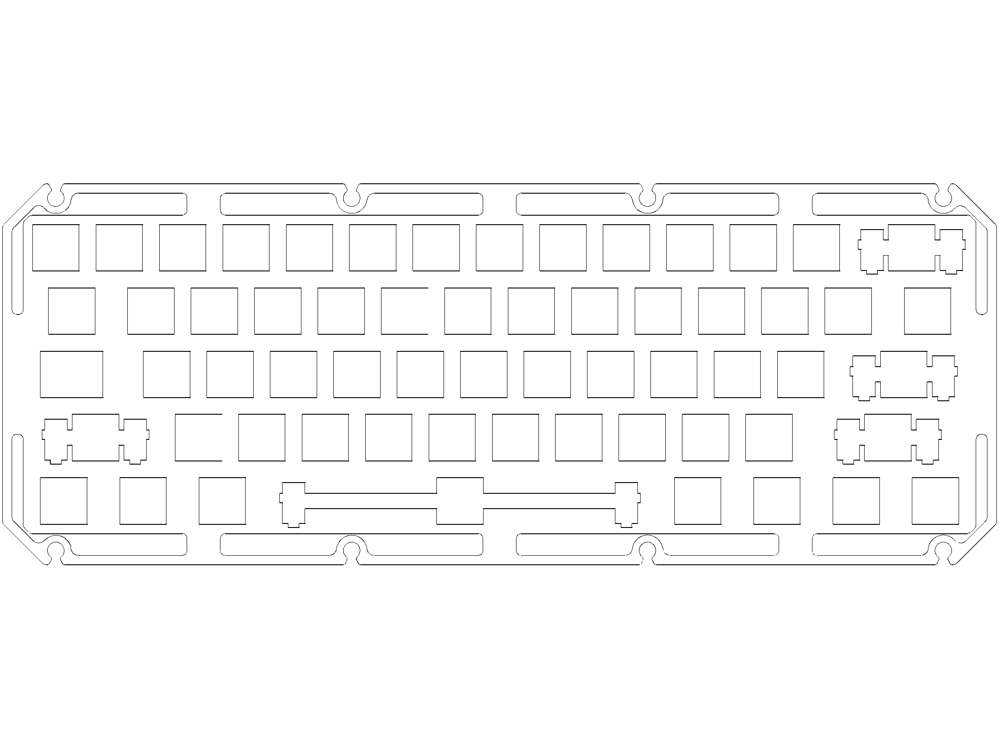
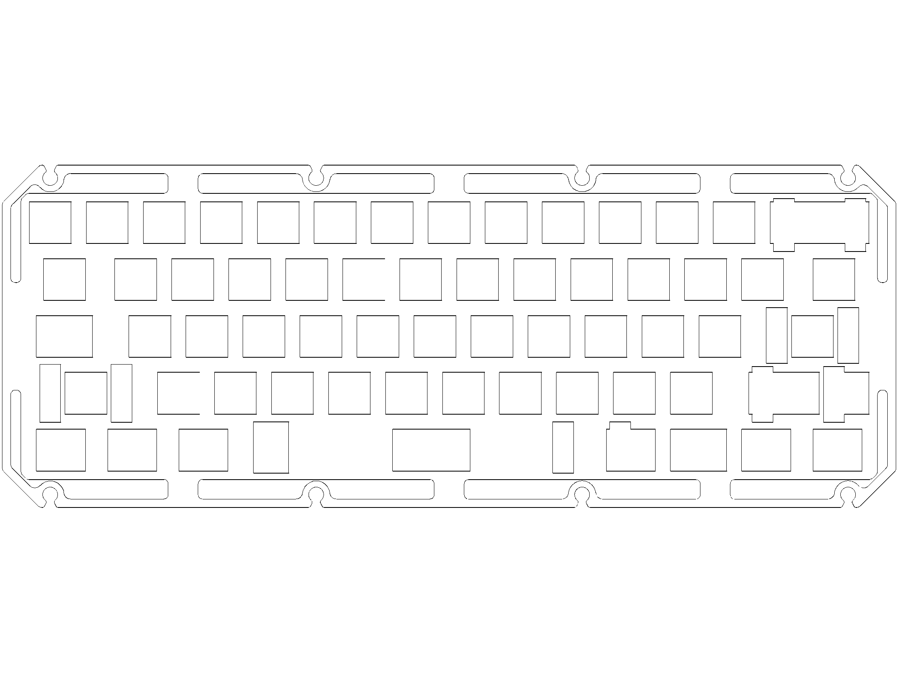
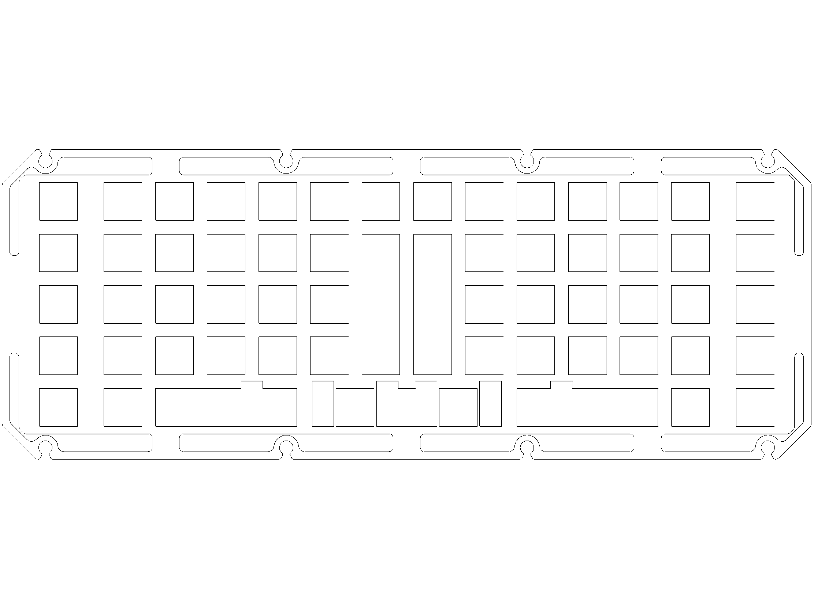
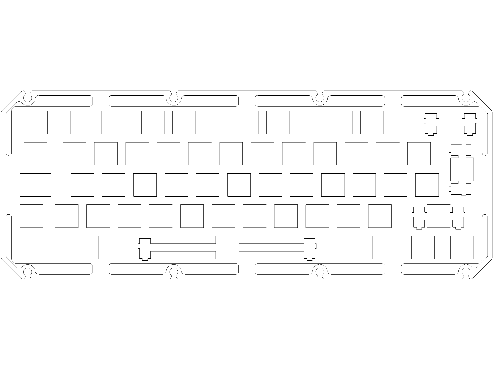
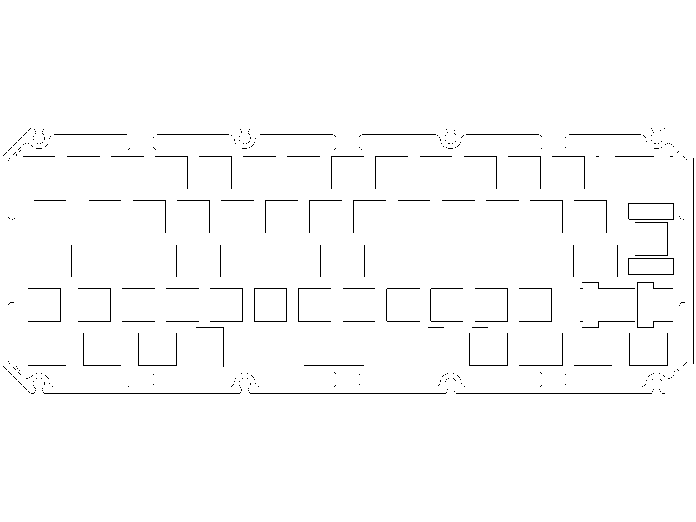
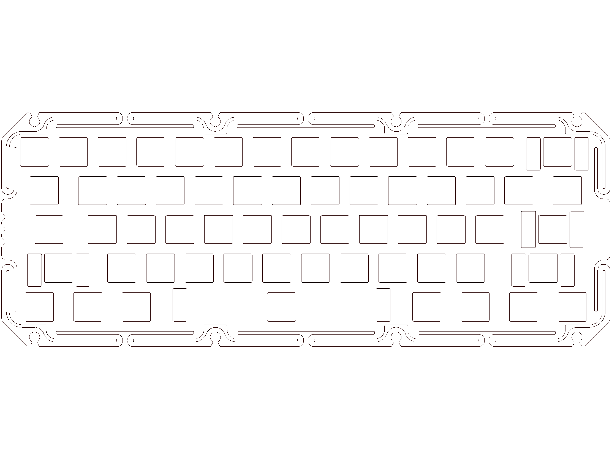
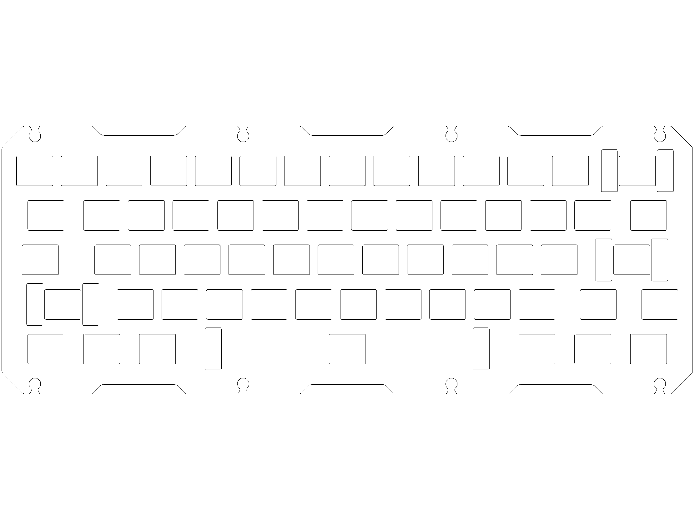
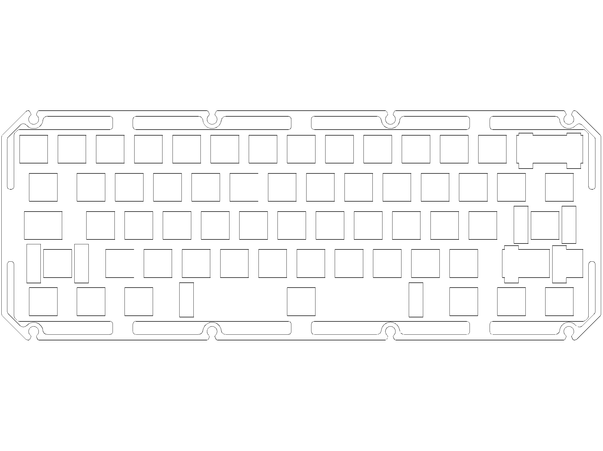
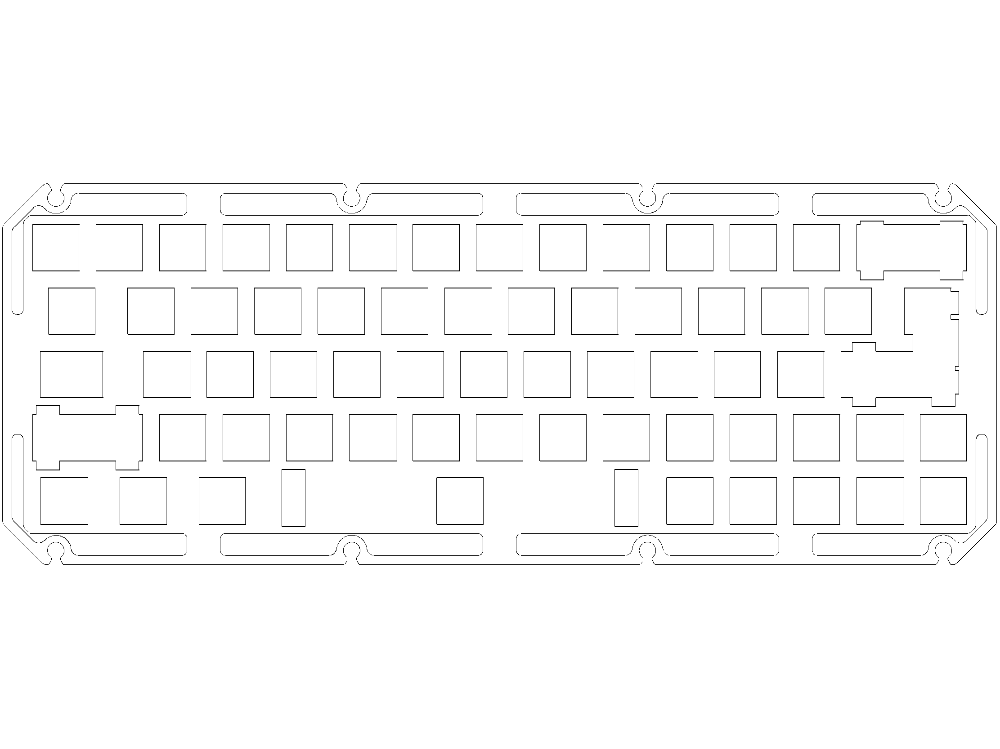
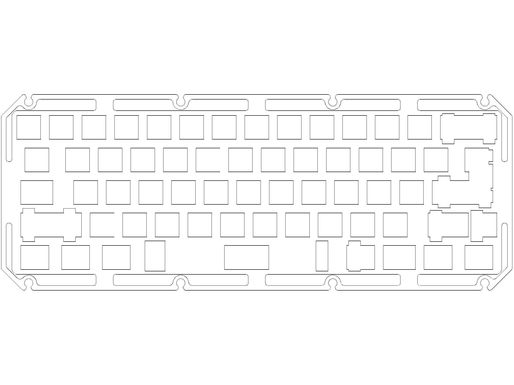

 HMKB-60-PLT-ANSI-STD  
 HMKB-60-PLT-ANSI  
 HMKB-60-PLT-BOARDWALK  
 HMKB-60-PLT-ISO-STD  
 HMKB-60-PLT-ISO  
 HMKB-60-PLT-STD_SerpCut  
 HMKB-60-PLT-TSAN-ALPS-FR4  
 HMKB-60-PLT-TSAN-ALPS  
 HMKB-60-PLT-TSAN-HHKB  
 HMKB-60-PLT-UNI-DZ60  
 HMKB-60-PLT-UNI-YAS  
 HMKB-60-PLT-UNI  
