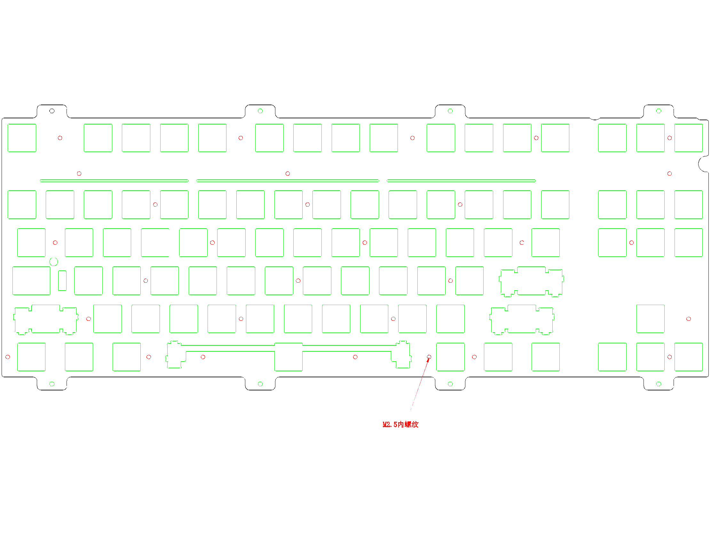
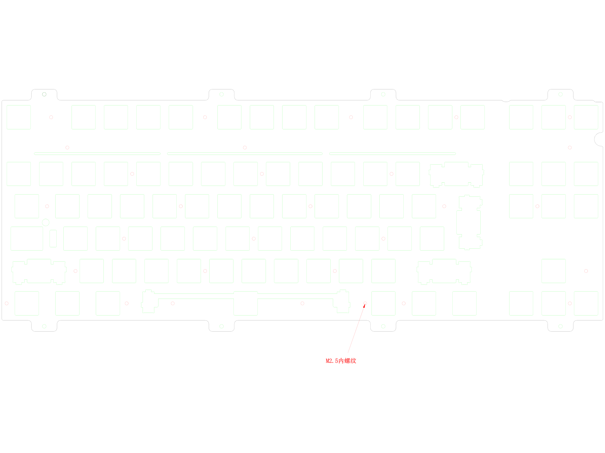
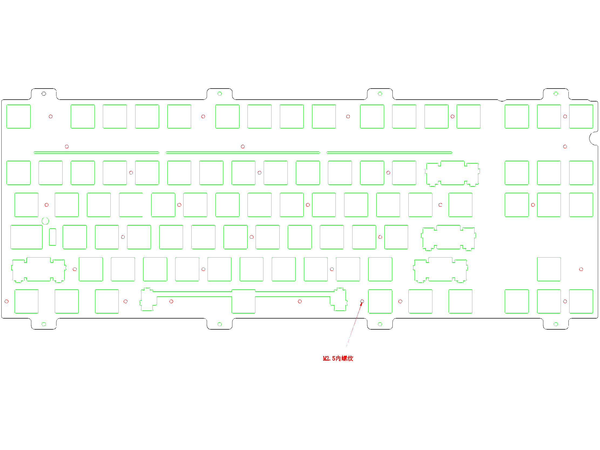
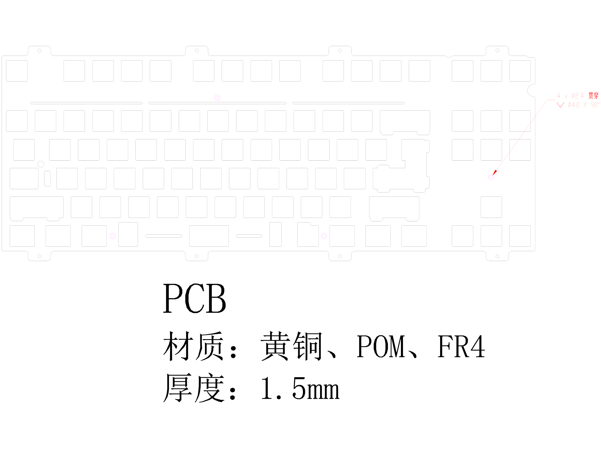
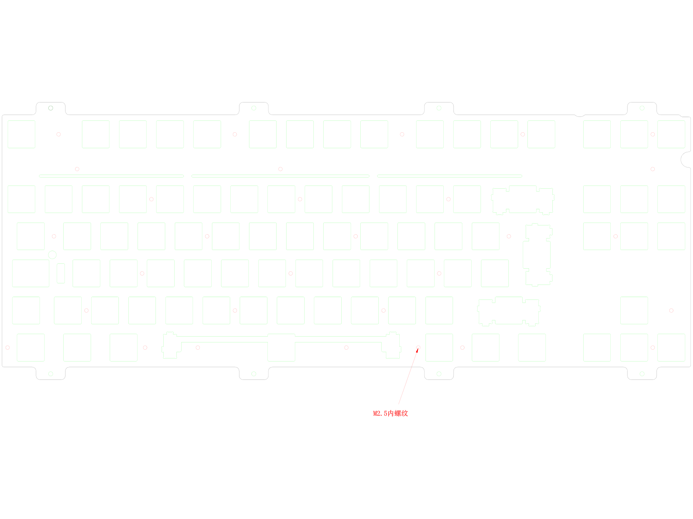

 Class 80R2 EC Split BS Plate   CLASS-80-R2 7u Enter Key EC Plate  CLASS-80-R2 EC Plate（2023-06-8-001）DWG  CLASS-80-R2 MX Plate（2023-04-23）  class60_topre  Class80-R2_topre_6u Only  Class80-R2_topre_6u_7u  Class80R2 ISO EC Plate 